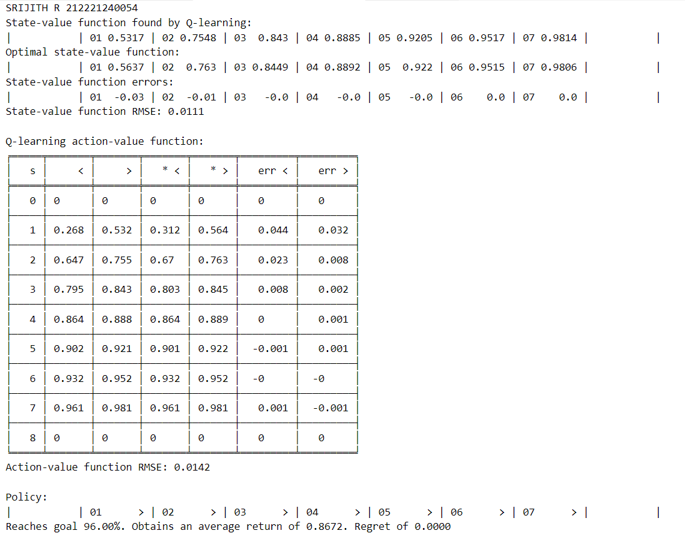
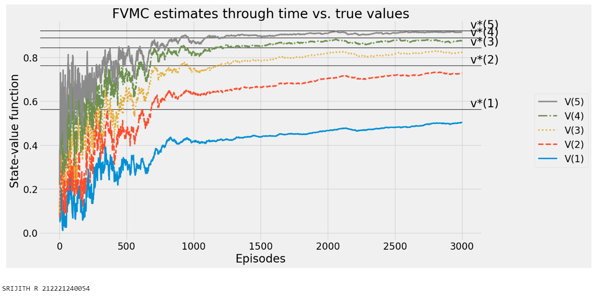
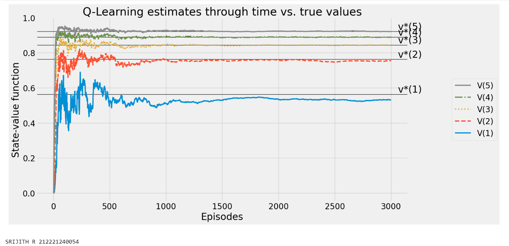

# Q Learning Algorithm


## AIM
To develop a Python program to find the optimal policy for the given RL environment using Q-Learning and compare the state values with the Monte Carlo method.

## PROBLEM STATEMENT
The bandit slippery walk problem is a reinforcement learning problem in which an agent must learn to navigate a 7-state environment in order to reach a goal state. The environment is slippery, so the agent has a chance of moving in the opposite direction of the action it takes.

### States
The environment has 7 states:

- Two Terminal States: G: The goal state & H: A hole state.
- Five Transition states / Non-terminal States including S: The starting state.
### Actions
The agent can take two actions:

- R: Move right.
- L: Move left.
### Transition Probabilities
The transition probabilities for each action are as follows:

- 50% chance that the agent moves in the intended direction.
- 33.33% chance that the agent stays in its current state.
- 16.66% chance that the agent moves in the opposite direction.
For example, if the agent is in state S and takes the "R" action, then there is a 50% chance that it will move to state 4, a 33.33% chance that it will stay in state S, and a 16.66% chance that it will move to state 2.

### Rewards
The agent receives a reward of +1 for reaching the goal state (G). The agent receives a reward of 0 for all other states.

### Graphical Representation


## Q LEARNING ALGORITHM
1. Initialize the Q-values arbitrarily for all state-action pairs.
2. Repeat for each episode:
    - Initialize the starting state.
    - Repeat for each step of episode:
        - Choose action from state using policy derived from Q (e.g., epsilon-greedy).
        - Take action, observe reward and next state.
        Choose action from next state using policy derived from Q (e.g., epsilon-greedy).
        - Update Q(s, a) := Q(s, a) + alpha * [R + gamma * Q(s', a') - Q(s, a)]
        - Update the state and action.
    - Until state is terminal.
3. Until performance converges.
4. Return Q.

## Q LEARNING FUNCTION
```py
#SRIJITH R 212221240054
def q_learning(env,
          gamma=1.0,
          init_alpha=0.5,
          min_alpha=0.01,
          alpha_decay_ratio=0.5,
          init_epsilon=1.0,
          min_epsilon=0.1,
          epsilon_decay_ratio=0.9,
          n_episodes=3000):
    nS, nA = env.observation_space.n, env.action_space.n
    pi_track = []
    Q = np.zeros((nS, nA), dtype=np.float64)
    Q_track = np.zeros((n_episodes, nS, nA), dtype=np.float64)
    def select_action(state, Q, epsilon):
        if np.random.random() > epsilon:
            return np.argmax(Q[state])
        else:
            return np.random.randint(nA)
    alphas = decay_schedule(init_alpha, min_alpha, alpha_decay_ratio, n_episodes)
    epsilons = decay_schedule(init_epsilon, min_epsilon, epsilon_decay_ratio, n_episodes)
    for e in tqdm(range(n_episodes), leave=False):
        state, done = env.reset(), False

        while not done:
            action = select_action(state, Q, epsilons[e])
            next_state, reward, done, _ = env.step(action)
            td_target = reward + gamma * Q[next_state].max() * (not done)
            td_error = td_target - Q[state][action]
            Q[state][action] = Q[state][action] + alphas[e] * td_error
            state = next_state
        Q_track[e] = Q
        pi_track.append(np.argmax(Q, axis=1))
    V = np.max(Q, axis=1)
    pi = lambda s: np.argmax(Q[s])
    return Q, V, pi, Q_track, pi_track
```

## OUTPUT:
### Optimal State Value Functions & Action Value Functions:


### State value functions of Monte Carlo method:


### State value functions of Qlearning method:


## RESULT:
Thus, Q-Learning outperformed Monte Carlo in finding the optimal policy and state values for the RL problem.
